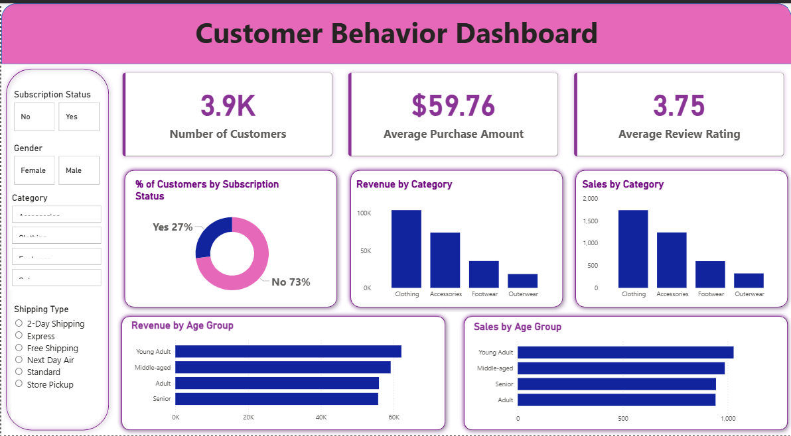

# 🛍️ Consumer Shopping Behavior Analysis
**End-to-End Data Analytics Project | Python · SQL · Power BI**

---

## Business Problem

Analyzed retail customer purchase data to uncover insights into buying behavior, customer loyalty, discounts, and subscription trends. The project focuses on helping businesses make data-driven decisions to improve sales and customer retention.

---

## Tools Used
`Python (Pandas)` · `PostgreSQL` · `Power BI`

---

## Project Structure
```
├── python/       → Data cleaning & feature engineering
├── sql/          → 10 business analysis queries
├── dashboard/    → Power BI interactive dashboard (.pbix)
├── presentation/ → Stakeholder presentation
└── docs/         → Business problem statement
```

---
## 📊 Power BI Dashboard

The interactive dashboard covers:
- Revenue breakdown by gender, age group, and category
- Subscription vs. non-subscription spend comparison
- Discount impact on purchase behavior
- Customer loyalty segmentation (New / Returning / Loyal)
- Seasonal purchase trends

---

## Dashboard Preview


---

## 🔑 Key Business Findings

1. **Subscribed customers** generate significantly higher average spend and total revenue compared to non-subscribers
2. **Loyal customers** (10+ previous purchases) show a strong tendency to subscribe — making them the prime target for retention campaigns
3. **Discount usage** is highest among mid-tier products — not premium ones — suggesting price-sensitivity in specific categories
4. **Young Adults and Adults** contribute the most revenue by age group
5. **Top-rated products** are not always the most purchased — indicating a gap between satisfaction and discovery

---

## 📂 Dataset

- **Source:** Kaggle — [Customer Shopping Behavior Dataset](https://www.kaggle.com/datasets/iamsouravbanerjee/customer-shopping-trends-dataset)
- **Size:** ~3,900 rows, 18 columns
- **Key Fields:** `customer_id`, `age`, `gender`, `item_purchased`, `category`, `purchase_amount`, `review_rating`, `subscription_status`, `discount_applied`, `previous_purchases`, `shipping_type`, `frequency_of_purchases`

---

## 👤 Author

**Atin Choudhary**
Data Analyst | Python · SQL · Power BI
📧 atin06choudhary@gmail.com
🔗 [GitHub](https://github.com/atinchoudhary)

